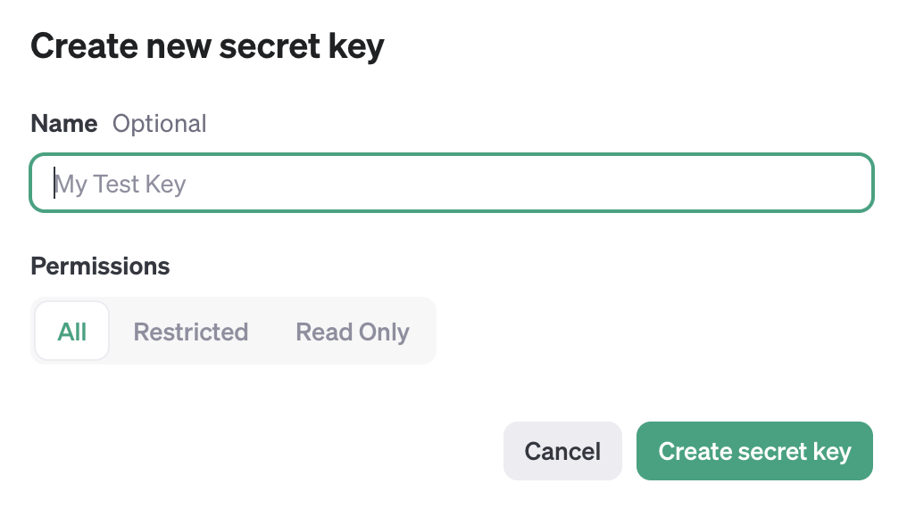

# Materials for the Workshop "Hands-On Text Coding with Large Language Models for Social Scientists with R"

| Authors | Last update |
|:------ |:----------- |
| Hauke Licht (https://github.com/haukelicht) | 2024-05-29 |

This repository contains the materials for the workshop "Hands-On Text Coding with Large Language Models for Social Scientists with R".

## Requirements and setup

Below I describe the software requirements ...

- R
- RStudio
- required R packages
- ollama

... and necessary setup steps.

- downloading the 8 billion LlaMa 3 model with `rollama` 
- creating an OpenAI (Plus) account 
- getting an OpenAI API key

If you run into difficulties, email me at `hauke.licht [at] wiso [dot] uni-koeln [dot] de` or [post an issue](https://github.com/haukelicht/llm_text_coding_r/issues).

### R

One main prerequisite for the workshop is that you have programmed in R before.
Hence, I am assuming that you have a working R installation on the computer you will be using during the workshop.

- Please make sure that your R version is 4.2.0 or higher: type `R.version` in your R console or `R --version` in your Terminal app (MacOS users) or Command Prompt (Windows users)
- If needed, download and install R as described here: https://posit.co/download/rstudio-desktop/

### RStudio

We will be using RStudio as a code editor in the workshop.
Please install **RStudio** before the workshop if neede as described here https://posit.co/download/rstudio-desktop/ 

### Required R packages

Next, you need to install install all required packages.
I recommend you use `renv` for this:

1. Open this folder as a project in RStudio (see [here](https://support.posit.co/hc/en-us/articles/200526207-Using-RStudio-Projects) how to)
2. open the R script [setup/setup_renv.R](./setup/setup_renv.R)
3. Run the complete script.

**_Alternative:_** If you don't want to use `renv` for installing and managing required packages, you can mannually install the packages (in the versions) listed in file [setup/requirements.txt](./setup/requirements.txt)

### ollama

We will be using `ollama` to interact with open-source LLMs.
Please install `ollama` from here: https://ollama.com/download

**Note** &mdash; You will need macOS 11 Big Sur (or later) or Windows 10 (or later).

### Open AI account and API access

#### 1. Create an OpenAI developer account

Go to [OpenAI](https://beta.openai.com/signup/) and create an account.

#### 2. Link a payment method and book some credit

1. go to platform.openai.com/account/billing/overview
2. link a valid credit card
3. click "Add to credit balance" and load a credit of, e.g., U.S.$ 10

#### 3. Get your API key

Go to the [API keys](https://platform.openai.com/api-keys) page.

Create a new API key by clicking on the "Create new secret key" button.

Fill your information in the form show below ... 

... and click on the "Create secrete "  button.

**_Note_** &mdash; 
This will be the only time you will be able to see your API key. 
Make sure you **take the next** step described below to store it in a safe place.

#### 4. Make your API key accessible in RStudio

Create a file called `.Renviron` in the root of your project folder.
(It's important that the file name starts with a dot!)
Open it in a text editor 

**_Alternative_** &mdash; Directly create and open the `.Renviron` file by running `usethis::edit_r_environ(scope = "project")` in your R console in RStudio (see https://github.com/irudnyts/openai?tab=readme-ov-file#authentication).

Now,

1. add `OPENAI_API_KEY=` in the first line of the file, 
2. copy your API key from your browser window,
3. paste the key in your `.Renviron` file behind the `=`
4. save the file and close it

#### 5. Verify that your API key is accessible in python

Run the code in notebook [test_openai_key.qmd](./code/test_openai_key.qmd) to verify that your API key is accessible in RStudio and your API access works.

## Questions and issues

If you have a question or encounter any issues, email me at `hauke.licht [at] wiso [dot] uni-koeln [dot] de` or [post an issue](https://github.com/haukelicht/llm_text_coding_r/issues).
